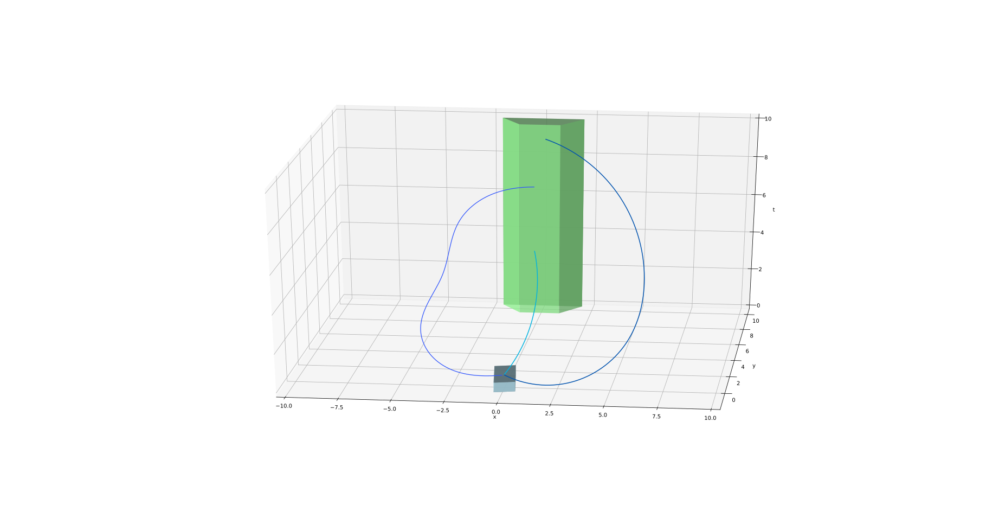
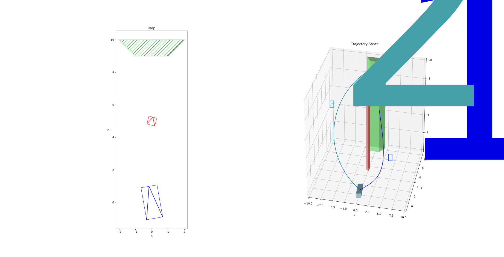
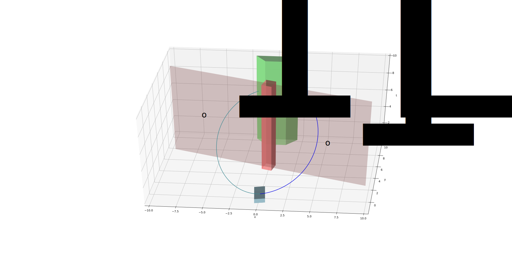
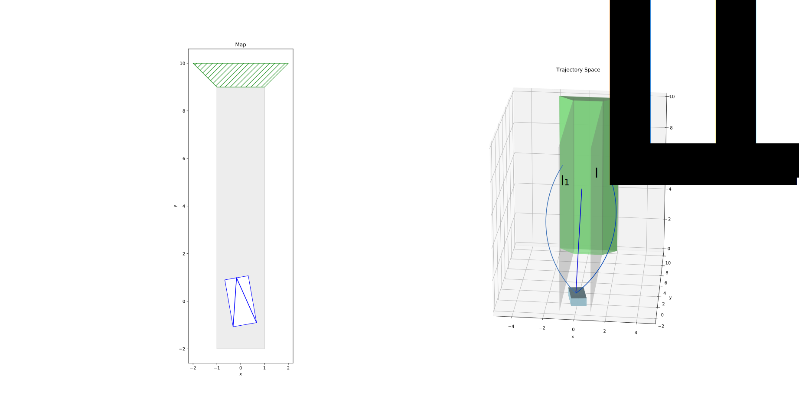
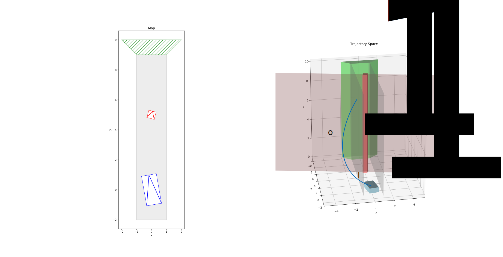

# Word Encoding of a Homotopy

The main idea here is that we want to encode a homotopy by a "word''. A "word" is derived from the objects in the environment. An obstacle has to be avoided, a lane has be driven on and any lane change is a decision. All of these intentions are conveyed as a homotopy and is intended to be conveyed as a homotopy.

## Homotopies from the environment

We consider all the objects in the environment in the short range (perception based obstacles and map objects). 

### Single Homotopy

If there were no obstacles and all of the map was one giant drivable area without lane boundaries, then all of the space would be a single homotopy. Taking any trajectory from the start to the goal would be equivalent.

Here all the trajectories are homotopic to each other since they can be smoothly deformed to another. Any trajectory in this space is homotopic to each other and thus, there is no decision to be made and any path from the current location to the goal is valid.

### Obstacle Homotopies

Suppose we have a single stationary obstacle. There are two homotopties. We can either go to the left of the obstacle or right of the obstacle. 

Note that the trajectories $\tau_1$ and $\tau_2$ are not homotopic. There is no way to continuously move between the trajectories without cutting through the pillar that represents the obstacle in trajectory space.

#### Encoding

We need to describe the word that describes our decision to either go to the left or right of the obstacle. Let us call our obstacle $o_1$. 

The following shows two manifolds denoting going left $o_1^L$ and right $o_1^R$ of the obstacle $o_1$. Thus, if a trajectory crosses a manifold, the homotopy word will include the letter of the manifold it is going through. If we going to the left of the obstacle will be transmitted as the word $o_1^L$.

### Lane Homotopies

We denote the boundaries of the lane as manifolds and crossing them adds to the lane homotopy.

We have three choices in the lane. Either we can stay in the lane with the homotopy word $I$, change lane to the left with homotopy word $l_1^L$ or change lane to the right $l_1^R$.

### Interaction Homotopies

When there are multiple elements in the map they will interact with each other to produce different homotopies. For example, in the following, we have a lane and an obstacle.

The given trajectory crosses the left lane boundary to go the left of the lane, goes to the left of the obstacle and then crosses the left lane boundary again to come back inside the lane. The homotopy will thus be denoted as 

$$
l_1^L \; O_1^L \; \left(l_1^L\right)^{-1}
$$

Note the inverse denotes the direction that we are crossing the manifold.

## Construction

### Assumptions

### Homotopy Words

## Encoding homotopies as manifold crossings

## Homotopy Enumeration

## Open Questions

- The heading of the 